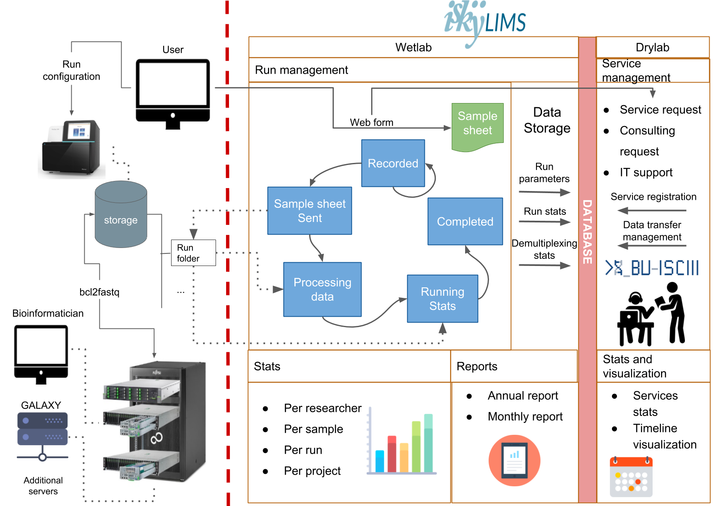
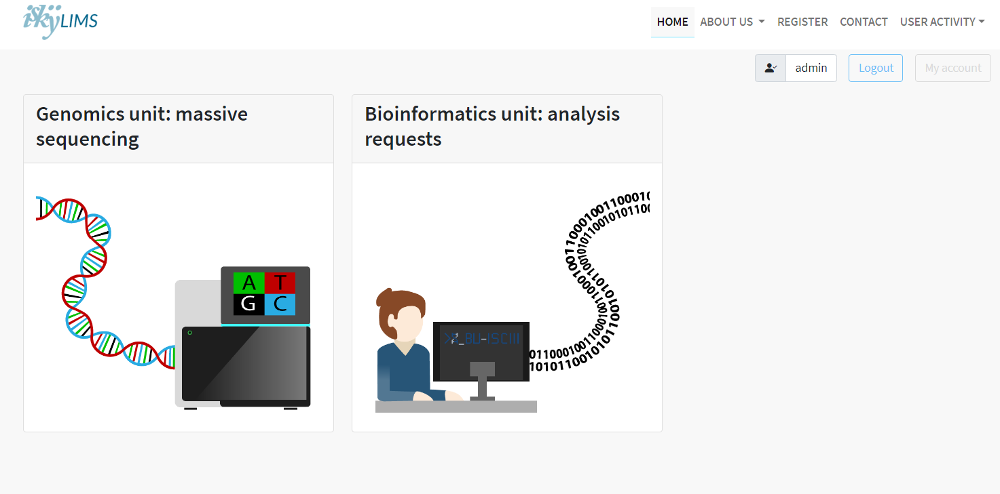
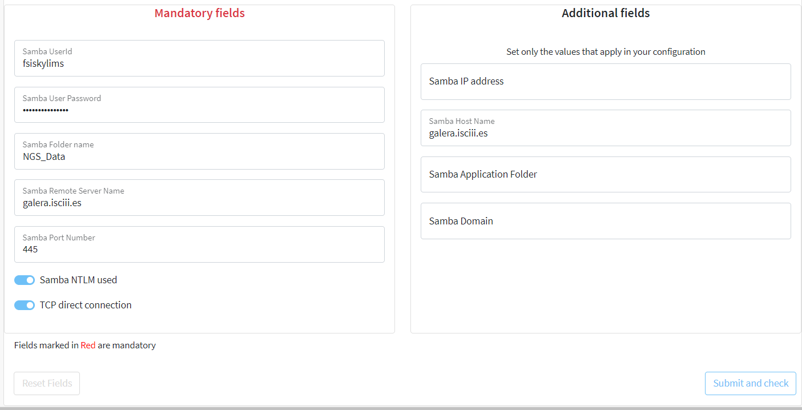

# iSkyLIMS

[](https://github.com/django/django)
[](https://www.python.org/)
[](https://getbootstrap.com)
[](https://github.com/BU-ISCIII/iskylims.git)

La introducción de la secuenciación masiva (MS) en las instalaciones de genómica ha significado un crecimiento exponencial en la generación de datos, lo que requiere un sistema de seguimiento preciso, desde la preparación de la biblioteca hasta la generación de archivos fastq, el análisis y la entrega al investigador. El software diseñado para manejar esas tareas se llama Sistemas de Gestión de Información de Laboratorio (LIMS), y su software debe adaptarse a las necesidades particulares de su laboratorio de genómica. iSkyLIMS nace con el objetivo de ayudar con las tareas de laboratorio húmedo e implementar un flujo de trabajo que guíe a los laboratorios de genómica en sus actividades, desde la preparación de la biblioteca hasta la producción de datos, reduciendo los posibles errores asociados a la tecnología de alto rendimiento y facilitando el control de calidad de la secuenciación. Además, iSkyLIMS conecta el laboratorio húmedo con el laboratorio seco, facilitando el análisis de datos por parte de bioinformáticos.



De acuerdo con la infraestructura existente, la secuenciación se realiza en un instrumento Illumina NextSeq. Los datos se almacenan en un dispositivo de almacenamiento masivo NetApp y los archivos fastq se generan (bcl2fastq) en un clúster de cómputo de alto rendimiento Sun Grid Engine (SGE-HPC). Los servidores de aplicaciones ejecutan aplicaciones web para el análisis bioinformático (GALAXY), la aplicación iSkyLIMS y alojan la capa de información de MySQL. El flujo de trabajo de iSkyLIMS WetLab se ocupa del seguimiento y las estadísticas de la ejecución de la secuenciación. El seguimiento de la ejecución pasa por cinco estados: "registrado", el usuario de genómica registra la nueva ejecución de la secuenciación en el sistema, el proceso esperará hasta que la ejecución se complete en la máquina y los datos se transfieran al dispositivo de almacenamiento masivo; "Envío de hoja de muestra", el archivo de hoja de muestra con la información de la ejecución de la secuenciación se copiará en la carpeta de ejecución para el proceso de bcl2fastq; "Procesamiento de datos", se procesan los archivos de parámetros de ejecución y los datos se almacenan en la base de datos; "Estadísticas en ejecución", los datos de desmultiplexación generados en el proceso de bcl2fastq se procesan y almacenan en la base de datos, "Completado", todos los datos se procesan y almacenan correctamente. Se proporcionan estadísticas por muestra, por proyecto, por ejecución y por investigación, así como informes anuales y mensuales. El flujo de trabajo de iSkyLIMS DryLab se encarga de la solicitud de servicios de bioinformática y estadísticas. El usuario solicita servicios que pueden estar asociados con una ejecución de secuenciación. Se proporciona seguimiento de estadísticas y servicios.

- [iSkyLIMS](#iskylims)
  - [Instalación](#instalación)
    - [Requisitos previos](#requisitos-previos)
    - [Instalación de iSkyLIMS en Docker](#instalación-de-iskylims-en-docker)
    - [Instalación de iSkyLIMS en su servidor con Ubuntu/CentOS](#instalación-de-iskylims-en-su-servidor-con-ubuntucentos)
      - [Clonar el repositorio de GitHub](#clonar-el-repositorio-de-github)
      - [Crear la base de datos de iSkyLIMS y otorgar permisos](#crear-la-base-de-datos-de-iskylims-y-otorgar-permisos)
      - [Configuración de ajustes](#configuración-de-ajustes)
      - [Ejecutar el script de instalación](#ejecutar-el-script-de-instalación)
    - [Actualización a la versión 3.0.0 de iSkyLIMS](#actualización-a-la-versión-300-de-iskylims)
      - [Prerrequisitos](#prerrequisitos)
      - [Clonar el repositorio de GitHub](#clonar-el-repositorio-de-github-1)
      - [Configuración de opciones](#configuración-de-opciones)
      - [Ejecución del script de actualización](#ejecución-del-script-de-actualización)
        - [Pasos que necesitan permisos de adminsitración](#pasos-que-necesitan-permisos-de-adminsitración)
        - [Pasos que no necesitan de permisos de administración](#pasos-que-no-necesitan-de-permisos-de-administración)
      - [Qué hacer si algo falla](#qué-hacer-si-algo-falla)
    - [Pasos finales de configuración](#pasos-finales-de-configuración)
      - [Configuración de SAMBA](#configuración-de-samba)
      - [Verificación de correo electrónico](#verificación-de-correo-electrónico)
      - [Configurar el servidor Apache](#configurar-el-servidor-apache)
      - [Verificación de la instalación](#verificación-de-la-instalación)
    - [Documentación de iSkyLIMS](#documentación-de-iskylims)

## Instalación

Si tienes algún problema o deseas informar de algún error, por favor, publícalo en [issue](https://github.com/BU-ISCIII/iSkyLIMS/issues)

### Requisitos previos

Antes de comenzar la instalación, asegúrate de lo siguiente:

- Tienes privilegios de **sudo** para instalar los paquetes de software adicionales que iSkyLIMS necesita.
- Base de datos MySQL > 8.0 o MariaDB > 10.4
- Tienes configurado un servidor local para enviar correos electrónicos.
- git > 2.34
- Tienes Apache servidor v2.4
- Tienes Python > 3.8
- Tienes una conexión a la carpeta compartida de Samba donde se almacenan las carpetas de ejecución (por ejemplo, galera/NGS_Data).
- Dependencias:
  - lsb_release:
    - RedHat/CentOS: `yum install redhat-lsb-core`
    - Ubuntu: `apt install lsb-core lsb-release`

### Instalación de iSkyLIMS en Docker

Puedes probar iSkyLIMS creando un contenedor Docker en tu máquina local.

Clona el repositorio de GitHub de iSkyLIMS y ejecuta el script de Docker para crear el contenedor Docker.

```bash
git clone https://github.com/BU-ISCIII/iSkyLIMS.git iSkyLIMS
sudo bash docker_install.sh
```

El script crea un contenedor de Docker Compose con 3 servicios:

- web1: contiene la aplicación web iSkyLIMS
- db1: contiene la base de datos MySQL
- samba: contiene el servidor Samba

Después de crear Docker y tener los servicios en funcionamiento, la estructura de la base de datos y los datos iniciales se cargan en la base de datos. Cuando se complete este paso, se le pedirá que defina al superusuario que tendrá acceso a las páginas de administración de Django. Puede escribir cualquier nombre, pero recomendamos que utilice "admin", ya que más adelante se le pedirá un usuario administrador cuando defina la configuración inicial.

Siga el mensaje de instrucciones para crear la cuenta del superusuario.

Cuando el script finalice, abra su navegador escribiendo **localhost:8001** para acceder a iSkyLIMS

### Instalación de iSkyLIMS en su servidor con Ubuntu/CentOS

#### Clonar el repositorio de GitHub

Abra una terminal de Linux y vaya a un directorio donde se descargará el código de iSkyLIMS

```bash
cd <su carpeta personal>
git clone https://github.com/BU-ISCIII/iskylims.git iskylims
cd iskylims
```

#### Crear la base de datos de iSkyLIMS y otorgar permisos

1. Cree una nueva base de datos llamada "iskylims" (esto es obligatorio).
2. Cree un nuevo usuario con permisos para leer y modificar esa base de datos.
3. Anote el nombre de usuario, la contraseña y la información del servidor de la base de datos.

#### Configuración de ajustes

Copia la plantilla de ajustes iniciales en un archivo llamado `install_settings.txt`

```bash
cp conf/template_install_settings.txt install_settings.txt
```

Abra el archivo de configuración con su editor favorito para establecer sus propios valores para la base de datos, la configuración de correo electrónico y la dirección IP local del servidor donde se ejecutará iSkyLIMS.

```bash
sudo nano install_settings.txt
```

#### Ejecutar el script de instalación

iSkyLIMS debe instalarse en el directorio "/opt".

Necesitará privilegios de administrador para instalar las dependencias. Para manejar diferentes responsabilidades de instalación dentro de la organización, donde es posible que no sea la persona con privilegios de administrador, nuestro script de instalación tiene estas opciones en el parámetro `--install`:

- `dep`: para instalar los paquetes de software, así como los paquetes de Python dentro del entorno virtual. Se necesita permisos de administrador.
- `app`: para instalar solo el software de la aplicación iSkyLIMS sin necesidad de tener permisos de administrador.
- `full`: si tiene directamente permisos de administrador, puede instalar tanto las dependencias como la aplicación con esta opción.

Ejecute uno de los siguientes comandos en una terminal de Linux para la instalación, de acuerdo con la descripción anterior.

```bash
# para instalar solo las dependencias
sudo bash install.sh --install dep

# para instalar la aplicación iskylims
bash install.sh --install app

# para instalar ambos al mismo tiempo
sudo bash install.sh --install full
```

### Actualización a la versión 3.0.0 de iSkyLIMS

Si ya tienes iSkyLIMS en la versión 2.3.0, puedes actualizar a la última versión estable, la 3.0.0.

La versión 3.0.0 es una versión importante con actualizaciones significativas en dependencias de terceros como Bootstrap. También hemos realizado un gran trabajo en la refactorización y el cambio de nombres de variables/funciones que afectan a la base de datos. Para obtener más detalles sobre los cambios, consulta las notas de la versión.

#### Prerrequisitos

Debido a que en esta actualización se modifican muchas tablas en la base de datos, es necesario que hagas una copia de seguridad de:

- La base de datos de iSkyLIMS.
- La carpeta de iSkyLIMS (carpeta de instalación completa, por ejemplo, /opt/iSkyLIMS).

Se recomienda encarecidamente que hagas estas copias de seguridad y las guardes de manera segura en caso de que la actualización falle, para poder recuperar tu sistema. Por ejemplo crea una carpeta en `/home/dadmin/backup_pro` que contenga la base de datos y la carpeta de /opt/iskylims para tenerla a mano y poder [restaurar el sistema](#qué-hacer-si-algo-falla).

#### Clonar el repositorio de GitHub

También hemos cambiado la forma en que se instala y actualiza iSkyLIMS. A partir de ahora, iSkyLIMS se descarga en una carpeta del usuario y se instala en otro lugar (por ejemplo, /opt/).

Abre una terminal de Linux y dirígete a un directorio donde se descargará el código de iSkyLIMS.

```bash
cd < directorio distinto al directorio de instalación >
git clone https://gitlab.isciii.es/BU-ISCIII/iskylims.git iskylims
cd iskylims
```

#### Configuración de opciones

Copia la plantilla de configuración inicial en un archivo llamado install_settings.txt

```bash
cp conf/template_install_settings.txt install_settings.txt
```

Abre el archivo de configuración con tu editor favorito para establecer tus propios valores para la base de datos, la configuración de correo electrónico y la dirección IP local del servidor donde se ejecutará iSkyLIMS.
> Si utilizas un sistema basado en Windows para modificar el archivo, asegúrate de que el archivo se guarde con una codificación amigable para Linux, como ASCII o UTF-8.

```bash
nano install_settings.txt
```

#### Ejecución del script de actualización

Si en tu organización se requiere que las dependencias u otros elementos que necesiten permisos de administrador sean instalados por una persona diferente a la que instala la aplicación, puedes utilizar el script de instalación en varios pasos de la siguiente manera.

El script te irá solicitando confirmación en algun paso, si todo está yendo bien sin errores deberás pulsar `y` o `yes` según te lo solicite.

> Nota: Los errores: "ERROR 1064 (42000) at line 1: You have an error in your SQL syntax; check the manual that corresponds to your MySQL server version for the right syntax to use near 'query' at line 1" son normales ya que se trata del título de las sentencias sql que no deben ejecutarse. Se puede ignorar.

##### Pasos que necesitan permisos de adminsitración

En primer lugar, debes cambiar el nombre de la carpeta de la aplicación en la carpeta de instalación (`/opt/iSkyLIMS`):

```bash
# Necesitas ser usuario root para realizar esta operación
sudo mv /opt/iSkyLIMS /opt/iskylims
```

Asegúrate de que la carpeta de instalación tenga los permisos correctos para que la persona que instala la aplicación pueda escribir en esa carpeta.

```bash
# En el caso de que tengas un script para esta tarea. Necesitarás ajustar este script de acuerdo al cambio en el nombre de la ruta: /opt/iSkyLIMS a /opt/iskylims
sudo /scripts/hardening.sh
```

En la terminal de Linux, ejecuta uno de los siguientes comandos que mejor se adapte a ti:

```bash
# para actualizar solo las dependencias del software. ES NECESARIO DISPONER DE PERMISOS DE ROOT.
sudo bash install.sh --upgrade dep

# PARA INSTALAR AMBAS COSAS AL MISMO TIEMPO. REQUIERE DE ROOT. SI SE VA A INSTALAR POR OTRA PERSONA SIN ROOT NO HACER ESTO.
sudo bash install.sh --upgrade full  --ren_app --script drylab_service_state_migration --script rename_app_name --script rename_sample_sheet_folder --script migrate_sample_type --script  migrate_optional_values --tables
```

##### Pasos que no necesitan de permisos de administración

A continuación instalamos la aplicación de iskylims usando el siguiente comando:

```bash
# para actualizar la aplicación de iskylims, incluyendo los cambios necesarios para la versión en base de datos. NO ES NECESARIO DISPONER DE PERMISOS ROOT.
bash install.sh --upgrade app --ren_app --script drylab_service_state_migration --script rename_app_name --script rename_sample_sheet_folder --script migrate_sample_type --script  migrate_optional_values --tables
```

Por último, asegúrate que los permisos de la carpeta son correctos.

```bash
# En el caso de que tengas un script para esta tarea. En esta versión han cambiado algunas rutas a ficheros, es posible que tengas que ajustar el script en consecuencia.
sudo /scripts/hardening.sh
```

#### Qué hacer si algo falla

Cuando actualizamos la aplicación usando el script estamos realizando varios cambios en la base de datos. Si algo falla tenemos que restaurar el estado anterior, antes de que hubiesemos realizado ninguna acción.

Necesitamos copiar de vuelta nuestro backup de carpet ade aplicación a /opt/iSkyLIMS (o la carpeta de instalación de nuestra elección), y restaurar la base de datos realizando algo como lo siguiente:

```bash
sudo rm -rf /opt/iskylims
sudo cp -r /home/dadmin/backup_prod/iSkyLIMS/ /opt/
sudo /scripts/hardening.sh
mysql -u iskylims -h dmysqlps.isciiides.es -p
# drop database iskylims;
# create database iskylims;
mysql -u iskylims -h dmysqlps.isciiides.es iskylims < /home/dadmin/backup_prod/bk_iSkyLIMS_202310160737.sql
```

### Pasos finales de configuración

#### Configuración de SAMBA

- Inicia sesión con la cuenta de administrador.
- Ve a Massive Sequencing
{width:50px}
- Ve a Configuración -> Configuración de SAMBA
- Completa el formulario con los parámetros apropiados para la carpeta compartida de SAMBA:


#### Verificación de correo electrónico

- Ve a Massive Sequencing
- Ve a Configuración -> Configuración de correo electrónico
- Completa el formulario con los parámetros necesarios para la configuración de correo electrónico y trata de enviar un correo de prueba.

#### Configurar el servidor Apache

Copia el archivo de configuración de Apache que se encuentra en la carpeta `conf` según tu distribución dentro del directorio de configuración de Apache y cambia el nombre a iskylims.conf. Revisa cualquier requerimiento de tu sistema, se trata solo de un ejemplo.

#### Verificación de la instalación

Abre el navegador y escribe "localhost" o la "IP local del servidor" para comprobar que iSkyLIMS está en funcionamiento.

También puedes verificar algunas funcionalidades mientras compruebas las conexiones de SAMBA y la base de datos usando:

- Ve a [configurationTest](https://iskylims.isciii.es/wetlab/configurationTest/)
- Haz clic en Enviar
- Verifica todas las pestañas para asegurarte de que cada conexión sea exitosa.
- Ejecuta las 3 pruebas para cada máquina de secuenciación: MiSeq, NextSeq y NovaSeq.

### Documentación de iSkyLIMS

La documentación de iSkyLIMS está disponible en [https://iskylims.readthedocs.io/en/latest](https://iskylims.readthedocs.io/en/latest)
