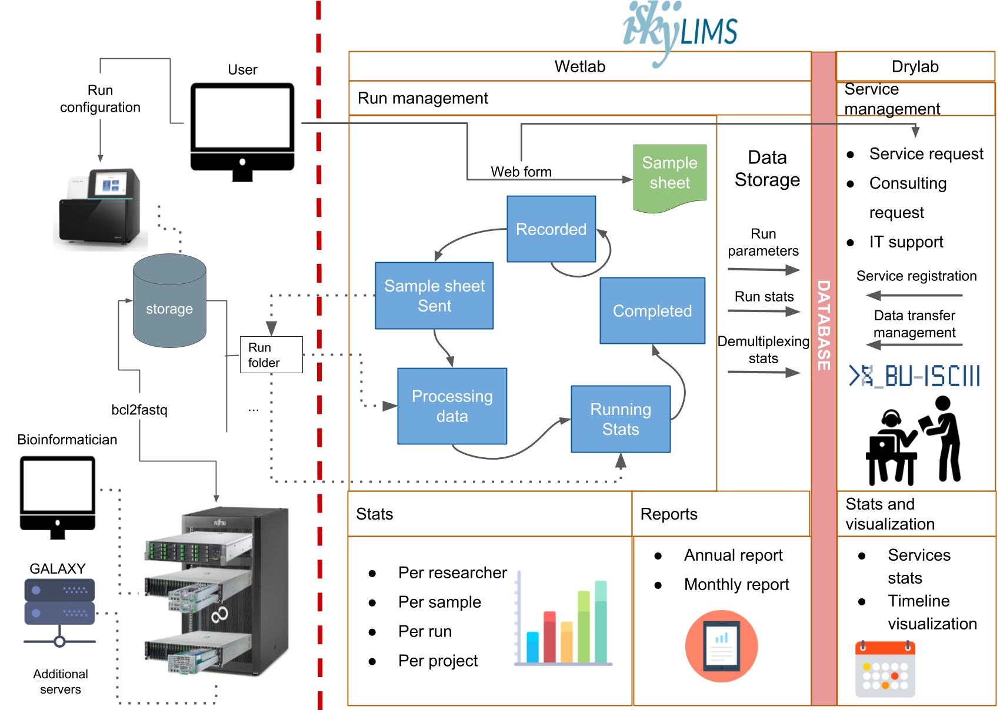
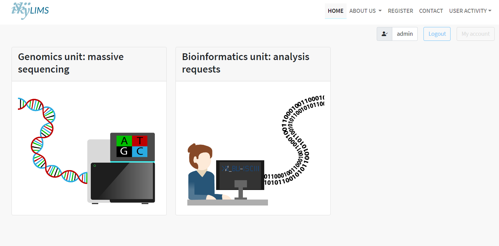
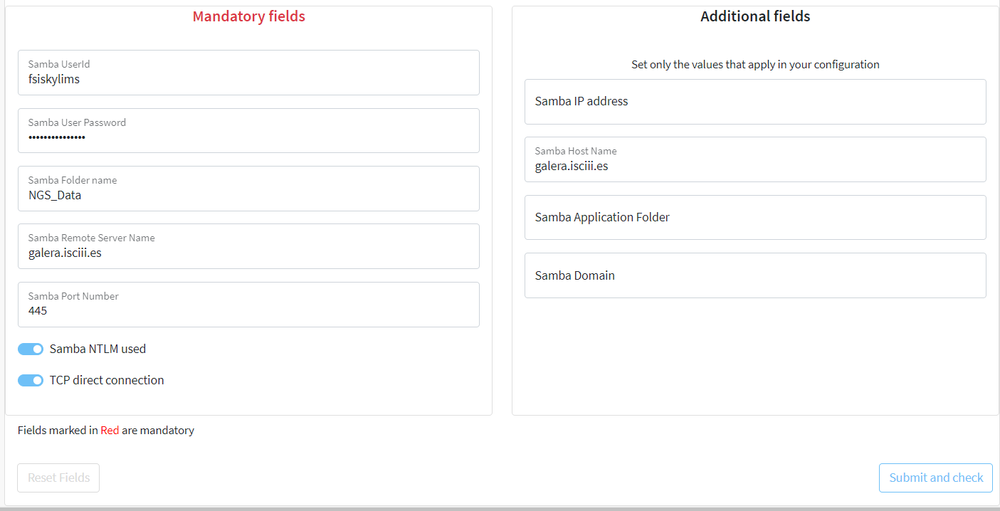

# iSkyLIMS

[](https://github.com/django/django)
[](https://www.python.org/)
[](https://getbootstrap.com)
[](https://github.com/BU-ISCIII/iskylims.git)

The introduction of massive sequencing (MS) in genomics facilities has meant an exponential growth in data generation, requiring a precise tracking system, from library preparation to fastq file generation, analysis and delivery to the researcher. Software designed to handle those tasks are called Laboratory Information Management Systems (LIMS), and its software has to be adapted to their own genomics laboratory particular needs. iSkyLIMS is born with the aim of helping with the wet laboratory tasks, and implementing a workflow that guides genomics labs on their activities from library preparation to data production, reducing potential errors associated to high throughput technology, and facilitating the quality control of the sequencing. Also, iSkyLIMS connects the wet lab with dry lab facilitating data analysis by bioinformaticians.



According to existent infrastructure sequencing is performed on an Illumina NextSeq instrument. Data is stored in NetApp mass storage device and fastq files are generated (bcl2fastq) on a Sun Grid Engine High Performance Computing cluster (SGE-HPC).
Application servers run web applications for bioinformatics analysis (GALAXY), the iSkyLIMS app, and host the MySQL information tier. iSkyLIMS WetLab workflow deals with sequencing run tracking and statistics. Run tracking passes through five states: "recorded” genomics user record the new sequencing run into the system, the process will wait till run is completed by the machine and data is transferred to the mass storage device; “Sample sheet sent” sample sheet file with the sequencing run information will be copied to the run folder for bcl2fastq process; “Processing data” run parameters files are processed and data is stored in the database; “Running stats” demultiplexing data generated in bcl2fastq process is processed and stored into the database, “Completed” all data is processed and stored successfully. Statistics per sample, per project, per run and per investigation are provided, as well as annual and monthly reports. iSkyLIMS DryLab workflow deals with bioinformatics services request and statistics. User request services that can be associated with a sequencing run. Stats and services tracking is provided.

- [iSkyLIMS](#iskylims)
  - [Get the code (required)](#get-the-code-required)
  - [Choose your path](#choose-your-path)
  - [Minimum requirements](#minimum-requirements)
  - [Docker deployment](#docker-deployment)
    - [Local test stack](#local-test-stack)
    - [Production container](#production-container)
      - [Persist logs/documents on the host](#persist-logsdocuments-on-the-host)
      - [Apache reverse proxy (host) + Gunicorn](#apache-reverse-proxy-host--gunicorn)
      - [Cron jobs inside the container](#cron-jobs-inside-the-container)
    - [Upgrade docker deployment](#upgrade-docker-deployment)
    - [Upgrade docker deployment v3.0.0 to 3.1.0](#upgrade-docker-deployment-v300-to-310)
      - [Back up first](#back-up-first)
      - [Refresh code and settings](#refresh-code-and-settings)
  - [Bare-metal deployment (Ubuntu/CentOS)](#bare-metal-deployment-ubuntucentos)
    - [Install](#install)
      - [Clone the repository](#clone-the-repository)
      - [Prepare the database](#prepare-the-database)
      - [Configure install\_settings.txt](#configure-install_settingstxt)
      - [Run install.sh](#run-installsh)
    - [Upgrade (3.0.0 to 3.1.0)](#upgrade-300-to-310)
      - [Back up first](#back-up-first-1)
      - [Refresh code and settings](#refresh-code-and-settings-1)
      - [Run upgrade steps requiring root](#run-upgrade-steps-requiring-root)
      - [Run upgrade steps without root](#run-upgrade-steps-without-root)
  - [Common operations (Docker + bare-metal)](#common-operations-docker--bare-metal)
    - [Database creation, users and grants](#database-creation-users-and-grants)
    - [Backups](#backups)
    - [Restore / rollback](#restore--rollback)
    - [What to do if something fails](#what-to-do-if-something-fails)
  - [Final configuration steps](#final-configuration-steps)
    - [SAMBA configurarion](#samba-configurarion)
    - [Email verification](#email-verification)
  - [Developer notes](#developer-notes)
    - [Django migrations workflow](#django-migrations-workflow)
    - [Persistent host paths](#persistent-host-paths)
    - [Configure Apache server](#configure-apache-server)
    - [Verification of the installation](#verification-of-the-installation)
  - [iSkyLIMS documentation](#iskylims-documentation)

For any problems or bug reporting please post us an [issue](https://github.com/BU-ISCIII/iSkyLIMS/issues)

## Get the code (required)

All installation paths assume you already cloned the repository:

```bash
git clone https://github.com/BU-ISCIII/iskylims.git iskylims
cd iskylims
```

## Choose your path

- **Docker (local test)**: spin up MySQL + Samba + iSkyLIMS with demo data to try the app quickly.
- **Docker (production container)**: deploy only the application container, pointing to your existing DB/Samba.
- **Bare-metal**: install or upgrade directly on Ubuntu/CentOS hosts with `install.sh`.

## Minimum requirements

- **sudo privileges** for dependency installation
- MySQL > 8.0 or MariaDB > 10.4
- Apache 2.4
- git > 2.34
- Python > 3.11
- Local email sender configured
- Access to the Samba share where run folders live
- `lsb_release` package:
  - RedHat/CentOS: `yum install redhat-lsb-core`
  - Ubuntu: `apt install lsb-core lsb-release`
- For containers: Docker Engine + Docker Compose v2, or Podman + `podman-compose`

## Docker deployment

### Local test stack

Bring up a full test stack (database, Samba, app) plus fixtures and demo data:

```bash
bash container_install.sh --test 2>&1 | tee test.log
```

Use `--engine podman` to run the same flow with Podman:

```bash
bash container_install.sh --test --engine podman 2>&1 | tee test.log
```

This uses `docker-compose.test.yml` by default.

Defaults can be customised:

- `--demo_data /path/to/iskylims_demo_data.tar.gz` to reuse a local demo archive (otherwise it is downloaded).
- `--skip_demo_data` or `--skip_test_data` to avoid loading extra data.
- `--install_type` (`full` by default) and `--git_revision` to control the build.
- `--script` to run one or more Django migration scripts through `install.sh` (repeat the flag as needed).

Example running a migration script during Docker install:

```bash
bash container_install.sh --test --script migrate_optional_values 2>&1 | tee test.log
```

When the script finishes, open `http://localhost:8001` and follow the prompt to create the Django superuser.

### Production container

Deploy the iSkyLIMS container against external MySQL/Samba services:

1. Copy and edit the production settings template:

    ```bash
    cp conf/docker_production_settings.txt conf/my_prod_settings.txt
    # edit conf/my_prod_settings.txt with your DB/Samba details
    ```

2. Build and run in production mode (uses `docker-compose.prod.yml` by default):

    ```bash
    bash container_install.sh --install_conf conf/my_prod_settings.txt 2>&1 | tee ./iskylims_docker_install_$(date +%Y%m%d_%H%M%S).log
    ```

   Use `--compose_file` to override the compose file or `--install_type`/`--git_revision` to change the build.
   Add `--engine podman` to use Podman instead of Docker.
   Tip: capture logs for troubleshooting:

    ```bash
    bash container_install.sh --install_conf conf/my_prod_settings.txt 2>&1 | tee ./iskylims_docker_install_$(date +%Y%m%d_%H%M%S).log
    ```

3. If this is a fresh install, create the Django superuser when prompted and complete the Samba configuration in the UI.

UID/GID for the container runtime user (default `1212:1212`):

- Export `APP_UID` and `APP_GID` before running `container_install.sh` if you need a different host UID/GID (for example, to write to `/opt/iskylims/static-host`).

```bash
export APP_UID=1212
export APP_GID=1212
```

Host directory and ownership preparation is described in [Persist logs/documents on the host](#persist-logsdocuments-on-the-host).

#### Persist logs/documents on the host

The production compose file mounts logs on the host and keeps documents in a named volume:

- `/var/log/apps/iskylims` → `/opt/iskylims/logs`
- `iskylims_documents` → `/opt/iskylims/documents`

If you override the compose file, ensure these mounts exist to keep logs and documents persistent.

Create host directories and set ownership to match the container UID/GID:

```bash
sudo mkdir -p /var/log/apps/iskylims
sudo mkdir -p /opt/iskylims/static-host
sudo chown -R ${APP_UID:-1212}:${APP_GID:-1212} /var/log/apps/iskylims /opt/iskylims/static-host
```

#### Apache reverse proxy (host) + Gunicorn

For production, the container runs `gunicorn` (not `manage.py runserver`). Use Apache on the host as a reverse proxy to `localhost:8001`.

Static files:

- The container writes collected static files to `/opt/iskylims/static`.
- `docker-compose.prod.yml` bind-mounts that path to `/opt/iskylims/static-host` on the host.
- Configure Apache with `Alias /static/ /opt/iskylims/static-host/`.

See the example config in `conf/iskylims_apache_reverse_proxy.conf` and the [Configure Apache server](#configure-apache-server) section below.

#### Cron jobs inside the container

Cron runs via a lightweight `crond` started by the container entrypoint script. The script writes the django-crontab entries to `/opt/iskylims/cron/iskylims` and starts `crond` with a user-writable PID file.

If you change `CRONJOBS`, rebuild or restart the container to regenerate the cron file.

### Upgrade docker deployment

If you set `APP_UID`/`APP_GID`, export them again before upgrade so the container runs with the same UID/GID:

```bash
export APP_UID=1212
export APP_GID=1212
```

Re-deploy the application container against an existing production database without touching data:

```bash
bash container_install.sh --install_conf conf/my_prod_settings.txt --action upgrade 2>&1 | tee ./iskylims_docker_install_$(date +%Y%m%d_%H%M%S).log
```

The upgrade path rebuilds/restarts the container and runs `install.sh` inside the app container, which regenerates migrations, applies them with `--fake-initial`, and skips superuser/demo/test data loading.

### Upgrade docker deployment v3.0.0 to 3.1.0

#### Back up first

Run the backup steps in [Backups](#backups) first.

For 3.0.0 -> 3.1.0, export the LibraryPool mapping first, then run the upgrade with pre/post scripts:

```bash
mysql --user=<db_user> --password=<db_password> --host=<db_server_ip> --port=<db_port> iskylims \
  -e "SELECT id, run_process_id_id FROM wetlab_library_pool" \
  > /tmp/library_pool_run_process.tsv
```

#### Refresh code and settings

```bash
cd <your working directory>/iskylims
git pull
cp conf/docker_production_settings.txt myprod_settings.txt
sudo nano myprod_settings.txt
```

Ensure the file uses Linux-friendly encoding (UTF-8/ASCII) if you edit it on Windows.

If you set `APP_UID`/`APP_GID`, export them again before upgrade so the container runs with the same UID/GID:

```bash
export APP_UID=1212
export APP_GID=1212
```

Run upgrade command:

```bash
bash container_install.sh --engine podman --install_conf my_prod_settings.txt --action upgrade \
  --script_before convert_rawtop_counter_to_int \
  --script_after library_pool_to_many_relation,/tmp/library_pool_run_process.tsv 2>&1 | tee ./iskylims_docker_install_$(date +%Y%m%d_%H%M%S).log
```

## Bare-metal deployment (Ubuntu/CentOS)

### Install

#### Clone the repository

```bash
cd <your working directory>
git clone https://github.com/BU-ISCIII/iskylims.git iskylims
cd iskylims
```

#### Prepare the database

Create the database and application user following [Database creation, users and grants](#database-creation-users-and-grants), then note DB host/port/user/password for `install_settings.txt`.

#### Configure install_settings.txt

```bash
cp conf/template_install_settings.txt install_settings.txt
nano install_settings.txt
```

Set your database, email, server IP/URL, and logging preferences in that file.

#### Run install.sh

iSkyLIMS is installed to `/opt/iskylims` by default. The single `install.sh` script handles both dependencies and the app; choose what you need with `--install`:

- `dep`: install system and Python dependencies (requires sudo).
- `app`: deploy iSkyLIMS code, update settings, run migrations, and collect static files (no sudo needed).
- `full`: run both stages in sequence.

Examples:

```bash
# only software dependencies
sudo bash install.sh --install dep

# only iSkyLIMS application
bash install.sh --install app --git_revision main --tables

# dependencies + application
sudo bash install.sh --install full --git_revision main --tables
```

- Add `--tables` to load the initial fixtures on first-time installs, or `--skip_tables` if you want to skip them.
- Capture logs for troubleshooting with `tee`:

  ```bash
  sudo bash install.sh --install full --git_revision main --tables 2>&1 | tee ./iskylims_install_$(date +%Y%m%d_%H%M%S).log
  ```

- If Apache is managed elsewhere, skip the automatic restart with `--skip_apache_restart`.

### Upgrade (3.0.0 to 3.1.0)

Follow these steps to move from version 3.0.0 to the 3.1.x series.

#### Back up first

Run the backup steps in [Backups](#backups) first.
- Additionally, back up the full installation folder (for example `/opt/iskylims`) for bare-metal rollback.
- If you use library pools, export them before upgrading:

  ```bash
mysql --user=<db_user> --password=<db_password> --host=<db_server_ip> --port=<db_port> iskylims \
  -e "SELECT id, run_process_id_id FROM wetlab_library_pool" \
  > /tmp/library_pool_run_process.tsv
  ```

#### Refresh code and settings

```bash
cd <your working directory>/iskylims
git pull
cp conf/template_install_settings.txt install_settings.txt
sudo nano install_settings.txt
```

Ensure the file uses Linux-friendly encoding (UTF-8/ASCII) if you edit it on Windows.

#### Run upgrade steps requiring root

Update system and Python dependencies:

```bash
sudo bash install.sh --upgrade dep 2>&1 | tee install_full.log
```

Make sure the installation directory permissions allow the non-root step to write to `/opt/iskylims` (adapt your hardening script if paths changed).

#### Run upgrade steps without root

Upgrade the application code and database:

```bash
# with library pool restore
bash install.sh --upgrade app --git_revision main \
  --script_before convert_rawtop_counter_to_int \
  --script_after library_pool_to_many_relation,/tmp/library_pool_run_process.tsv
```

Upgrades regenerate migrations and apply them with `--fake-initial` so existing tables remain intact, matching the Docker workflow.

## Common operations (Docker + bare-metal)

### Database creation, users and grants

Run as MySQL root:

```sql
CREATE DATABASE IF NOT EXISTS iskylims CHARACTER SET utf8mb4 COLLATE utf8mb4_unicode_ci;

CREATE USER IF NOT EXISTS 'iskylims'@'%' IDENTIFIED BY 'djangopass';
CREATE USER IF NOT EXISTS 'iskylims'@'localhost' IDENTIFIED BY 'djangopass';

GRANT ALL PRIVILEGES ON iskylims.* TO 'iskylims'@'%';
GRANT ALL PRIVILEGES ON iskylims.* TO 'iskylims'@'localhost';

FLUSH PRIVILEGES;
```

Verification:

```sql
SHOW GRANTS FOR 'iskylims'@'%';
```

### Backups

Database dump:

```bash
mysqldump -h <db_host> -P <db_port> -u iskylims -p iskylims > iskylims_$(date +%Y%m%d_%H%M%S).sql
```

Logs archive:

```bash
tar -czf iskylims_logs_$(date +%Y%m%d_%H%M%S).tgz -C /var/log/apps/iskylims .
```

Documents volume archive:

```bash
docker run --rm -v iskylims_documents:/from -v "$PWD":/to alpine \
  tar -czf /to/iskylims_documents_$(date +%Y%m%d_%H%M%S).tgz -C /from .
```

With Podman, use the same command replacing `docker` with `podman`.

Suggested order before upgrades:

1. DB dump
2. Documents volume archive
3. Logs archive

### Restore / rollback

Restore DB:

```bash
mysql -h <db_host> -P <db_port> -u iskylims -p iskylims < iskylims_YYYYMMDD_HHMMSS.sql
```

Restore documents volume:

```bash
docker run --rm -v iskylims_documents:/to -v "$PWD":/from alpine \
  sh -lc "cd /to && tar -xzf /from/iskylims_documents_YYYYMMDD_HHMMSS.tgz"
```

With Podman, use the same command replacing `docker` with `podman`.

Restore logs:

```bash
mkdir -p /var/log/apps/iskylims
tar -xzf iskylims_logs_YYYYMMDD_HHMMSS.tgz -C /var/log/apps/iskylims
```

Bare-metal full rollback example:

```bash
sudo rm -rf /opt/iskylims
sudo cp -r /home/dadmin/backup_prod/iSkyLIMS/ /opt/
sudo /scripts/hardening.sh
mysql -u iskylims -p -h <db_host> iskylims < /home/dadmin/backup_prod/bk_iSkyLIMS_YYYYMMDDHHMM.sql
```

### What to do if something fails

When install/upgrade fails, restore the previous state and retry with logs enabled.

Quick diagnostics:

```bash
# bare-metal
cd /opt/iskylims
python manage.py check

# docker
docker compose -f docker-compose.prod.yml ps
docker compose -f docker-compose.prod.yml logs --tail 200 app
# podman
podman-compose -f docker-compose.prod.yml ps
podman-compose -f docker-compose.prod.yml logs --tail 200 app
```

If you suspect a corrupted image/build cache in Docker:

```bash
docker compose -f docker-compose.prod.yml build --no-cache app
docker compose -f docker-compose.prod.yml up -d --force-recreate app
```

## Final configuration steps

### SAMBA configurarion

- Login with admin account.
- Go to Massive sequencing
{width:50px}
- Go to Configuration -> Samba configuration
- Fill the form with the appropiate params for the samba shared folder:


### Email verification

- Go to Massive sequencing
- Go to Configuration -> Email configuration
- Fill the form with the needed params for your email configuration and try to send a test email.

## Developer notes

### Django migrations workflow

Migrations are committed to the repo. Do not run `makemigrations` during install/upgrade.

Baseline + upgrade flow for new releases:

1. Generate baseline migrations from the last stable tag (example 3.0.0).
2. Commit the baseline migrations.
3. Generate new migrations on `develop` for schema changes and commit them.
4. Upgrades run `migrate --fake-initial` once to align existing tables, then `migrate` to apply the new migration files.

### Persistent host paths

See [Persist logs/documents on the host](#persist-logsdocuments-on-the-host) in the production deployment section.

### Configure Apache server

Copy the apache configuration file according to your distribution inside the apache configuration directory and rename it to iskylims.conf

Typical config locations:

- Ubuntu/Debian: `/etc/apache2/sites-available/iskylims.conf` (enable with `a2ensite`)
- CentOS/RHEL: `/etc/httpd/conf.d/iskylims.conf`

Suggested steps (host Apache as reverse proxy):

1. Copy the example config:

    ```bash
    sudo cp conf/iskylims_apache_reverse_proxy.conf /etc/apache2/sites-available/iskylims.conf
    # CentOS/RHEL:
    # sudo cp conf/iskylims_apache_reverse_proxy.conf /etc/httpd/conf.d/iskylims.conf
    ```

2. Edit the config:

    - Set `ServerName`
    - Ensure `ProxyPass` points to `http://localhost:8001/`
    - Ensure `Alias /static/ /opt/iskylims/static-host/`

3. Create the static folder on the host:

    ```bash
    sudo mkdir -p /opt/iskylims/static-host
    ```

4. Enable required modules (Ubuntu/Debian):

    ```bash
    sudo a2enmod proxy proxy_http headers
    sudo a2ensite iskylims.conf
    ```

5. Reload Apache:

    ```bash
    sudo systemctl reload apache2
    # CentOS/RHEL:
    # sudo systemctl reload httpd
    ```

### Verification of the installation

Open the navigator and type "localhost" or the "server local IP" and check that iSkyLIMs is running.

You can also check some of the functionality, while also checking samba and database connections using:

- Go to [configuration test](https://iskylims.isciii.es/wetlab/configurationTest/)
- Click submit
- Check all tabs so every connectin is successful.
- Run the 3 tests for each sequencing machine: MiSeq, NextSeq and NovaSeq.

## iSkyLIMS documentation

iSkyLIMS documentation is available at [https://iskylims.readthedocs.io/en/latest](https://iskylims.readthedocs.io/en/latest)
